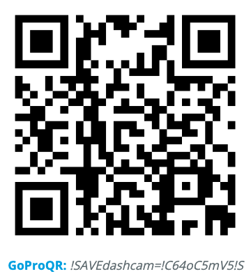

# GoPro-DashCam
Use GoPro as a dash camera.

### Step I. Download and install [GoPro Labs](https://gopro.com/en/us/info/gopro-labs) firmware

### Step II. Reset all metadata
`!RESET` 

### Step III. Load `dashcam` script at boot
`*BOOT="!Ldashcam"` 

### Step IV. Save the following commands as a script called `dashcam`
`!SAVEdashcam=!C64mSoMPRES="15,DashCam"mSr1080p30e1!NfW0t0hS0dR7200aSoC5!S` 

explanation: 
`!C64`: Clear up to 64GB of data, the older files will be removed. 
`!S`: Start capture immediately. 

Now, restart your GoPro, it will automatically capture video.
